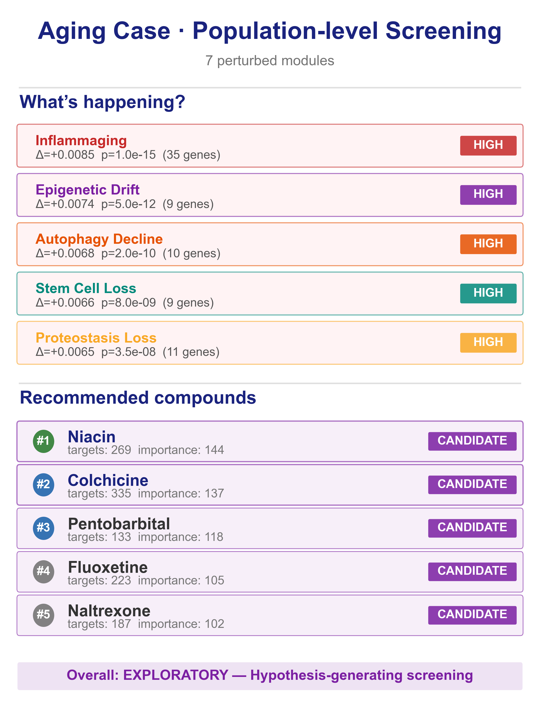
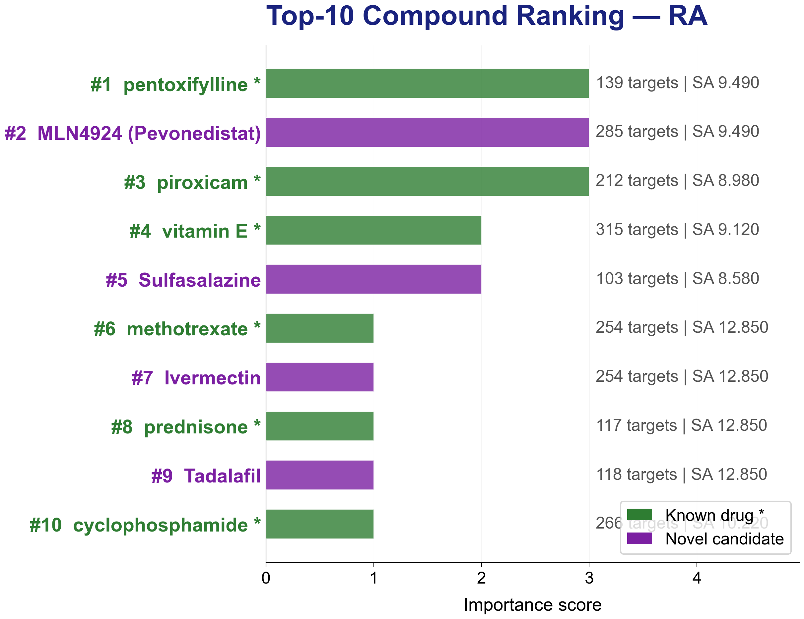
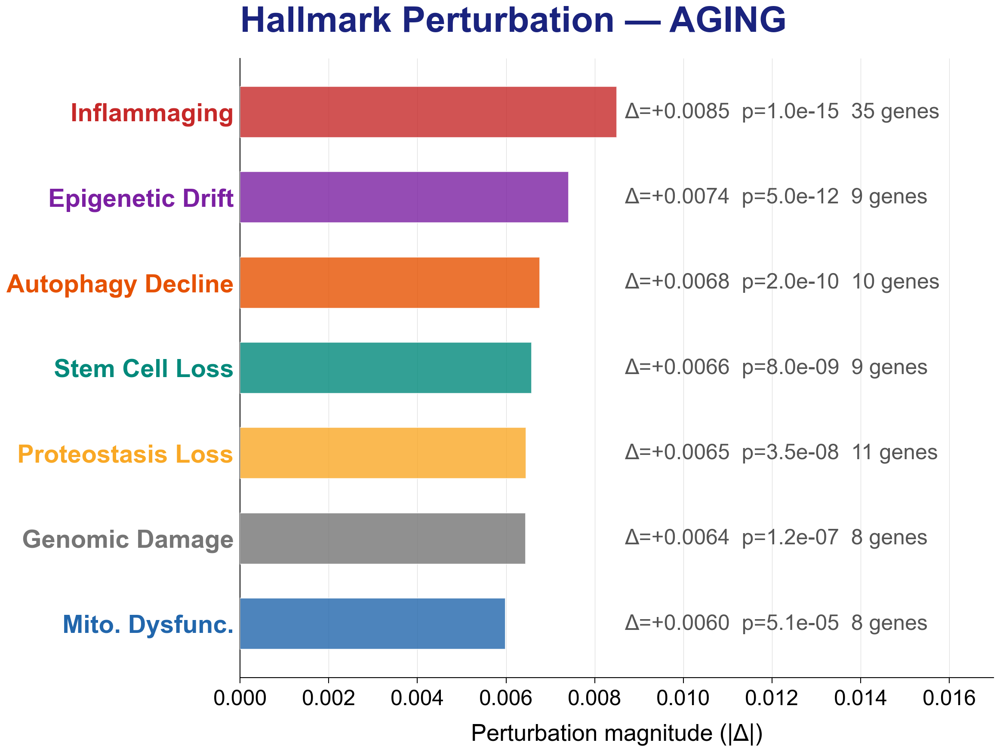
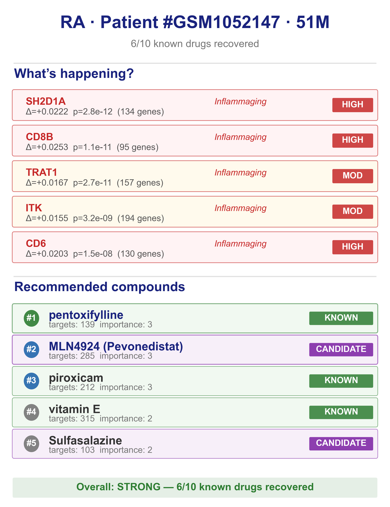

# SteeraMed Core

[English](README.md) | [中文](README.zh-CN.md)

[](https://pypi.org/project/steeramed-core/)
[](https://www.python.org/)
[](LICENSE)
[](https://doi.org/10.20944/preprints202605.1578.v1)

**SteeraMed: A Steerable Biomedical World Model** — Personalized intervention evidence chains from DNA methylation data for longevity, aging, and chronic diseases.

> Select a patient case → Generate individualized drug evidence in 30 seconds.
> [SteeraMed.com](https://steeramed.com) · [Paper](https://doi.org/10.20944/preprints202605.1578.v1)

## What is a Biomedical World Model?

Traditional systems biology:
- Population statistics → average effects → universal guidelines
- "Is this drug effective for the population?"

Steerable Biomedical World Model (SBWM):
- Individual perturbation → matched PPI modules → personalized evidence chain
- "Is this drug effective **for you**?"

Key differences:
| | Systems Biology | Steerable Biomedical World Model |
|---|---|---|
| Unit of analysis | Population | Individual (N-of-1) |
| Question | Group average | Personal match |
| Output | General guideline | 4-layer evidence chain |
| Drug ranking | Clinical trials | SA alignment + bootstrap |

## Four-Layer Evidence Chain

```
Layer 1: PPI Module Perturbation  ← "What's different in your biology?"
Layer 2: Compound SA Alignment    ← "Which compounds can correct it?"
Layer 3: Mechanism Annotation     ← "Why does this compound work?"
Layer 4: Bootstrap Confidence     ← "How reliable is this result?"
```

## Quick Start

```bash
pip install steeramed-core
python -m steeramed_core
```

Interactive case selector:

```
🧬 SteeraMed Core — N-of-1 Evidence Chain Explorer
═════════════════════════════════════════════════════

Select a patient case:
  [1] 🧓 Aging · Population Screening
  [2] 🧑 RA · 51M · T-cell Perturbation
  [3] 🧑 Depression · 52M · Innate Immunity

Enter choice [1-3]: 2

✅ Generated 4 figures in results/:
  📊 hallmark_bar.png      — Hallmark perturbation profile
  💊 drug_ranking.png       — Top-10 compound ranking
  🔗 evidence_network.png  — Drug-PPI-Hallmark alignment
  📋 patient_card.png       — One-page patient summary
```

Batch mode:

```bash
python -m steeramed_core --all          # all cases
python -m steeramed_core --case ra_303  # specific case
python -m steeramed_core --list         # list available cases
```

## Gallery

**Patient Summary Card** (Aging case):



**Drug Ranking** (RA case):



**Hallmark Perturbation** (Aging case):



**Patient Summary Card** (RA case):



## Available Cases

| Case | Disease | Key Finding | Evidence |
|------|---------|-------------|----------|
| Aging · Population | GSE40279 | Niacin #1, 2/5 geroprotectors | MODERATE |
| RA · 51M | GSE42861 | 6/10 known RA drugs, pentoxifylline #1 | STRONG |
| Depression · 52M | GSE128235 | creatine #1, innate immunity | EXPLORATORY |

## API

```python
import json
from pathlib import Path
from steeramed_core.viz.patient_card import plot_patient_card
from steeramed_core.viz.drug_ranking import plot_drug_ranking

p = Path(__file__).parent / "steeramed_core" / "presets" / "example_patients"
data = json.loads((p / "ra_patient_303.json").read_text(encoding="utf-8"))
fig = plot_patient_card(data)
fig.savefig("my_patient_card.png", dpi=300)
```

## Data Sources & Acknowledgments

This package includes pre-computed results derived from the following open databases. We gratefully acknowledge the original data providers:

- **PPI Network**: STRING v12.5 — Szklarczyk et al., *Nucleic Acids Res* 53(D1), 2025. [CC BY 4.0](https://string-db.org/cgi/access?footer_active_subpage=licensing)
- **Compound–Target Interactions**: STITCH — Kuhn et al., *Nucleic Acids Res* 36(Database), 2008. [CC BY-NC](http://stitch-db.org) — **this package uses STITCH-derived data for academic research only; commercial applications require [separate authorization from EMBL](mailto:stitch@embl.de)**
- **Methylation Data**: GEO (NCBI) — public domain
- **Hallmark Gene Sets**: MSigDB — Liberzon et al., *PNAS* 112(25), 2015. [CC BY 4.0](https://www.gsea-msigdb.org/gsea/msigdb_license.jsp)

> **Note**: This repository distributes **pre-computed analytical results** (e.g., ranked compound lists, PPI module summaries), not the original STRING or STITCH databases. Users who wish to access or redistribute the underlying databases must comply with their respective license terms.

## Citation

If you use SteeraMed Core in your research, please cite both companion papers:

- Framework paper: Xiong J. *World Models for Biomedicine: A Steerability Framework.* [doi:10.20944/preprints202605.0366.v1](https://doi.org/10.20944/preprints202605.0366.v1)
- Implementation paper: Xiong J. *SteeraMed: A Biomedical World Model for N-of-1 Intervention Reasoning across Chronic Diseases and Aging.* [doi:10.20944/preprints202605.1578.v1](https://doi.org/10.20944/preprints202605.1578.v1)

```bibtex
@article{xiong2026steeramed,
  title={SteeraMed: A Biomedical World Model for N-of-1 Intervention Reasoning across Chronic Diseases and Aging},
  author={Xiong, Jianghui},
  journal={Preprints.org},
  year={2026},
  doi={10.20944/preprints202605.1578.v1}
}
@article{xiong2026framework,
  title={World Models for Biomedicine: A Steerability Framework},
  author={Xiong, Jianghui},
  journal={Preprints.org},
  year={2026},
  doi={10.20944/preprints202605.0366.v1}
}
```

## Disclaimer

This software generates hypothesis-generating insights only. It is not a medical device and does not provide treatment recommendations. Always consult qualified healthcare professionals for medical decisions.

## Keywords

`biomedical world model` · `medical world model` · `steerability` · `longevity` · `aging` · `personalized medicine` · `n-of-1` · `DNA methylation` · `epigenetics` · `drug ranking` · `PPI network` · `evidence chain` · `precision medicine` · `intervention reasoning` · `rheumatoid arthritis` · `depression` · `hallmark` · `methylation age`

## License

MIT License. This applies to the **code** in this repository only.

The **pre-computed data files** (JSON files in `steeramed_core/presets/`) incorporate derivative results from STITCH (CC BY-NC). These data files are provided for **academic research and educational purposes only**. Commercial use of STITCH-derived data requires [authorization from EMBL](mailto:stitch@embl.de).
