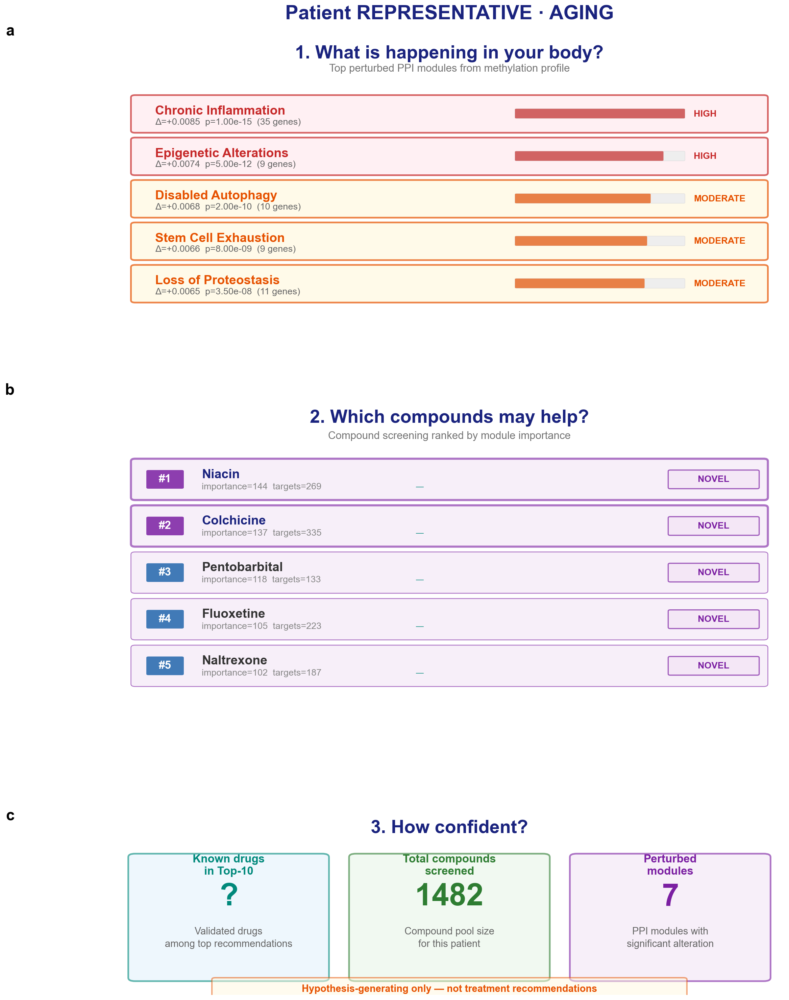
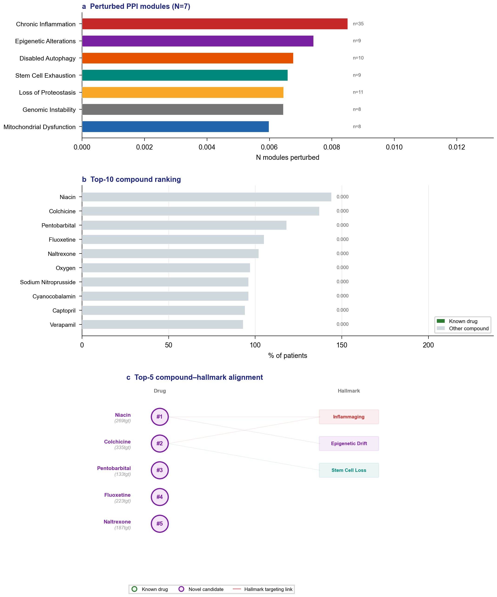
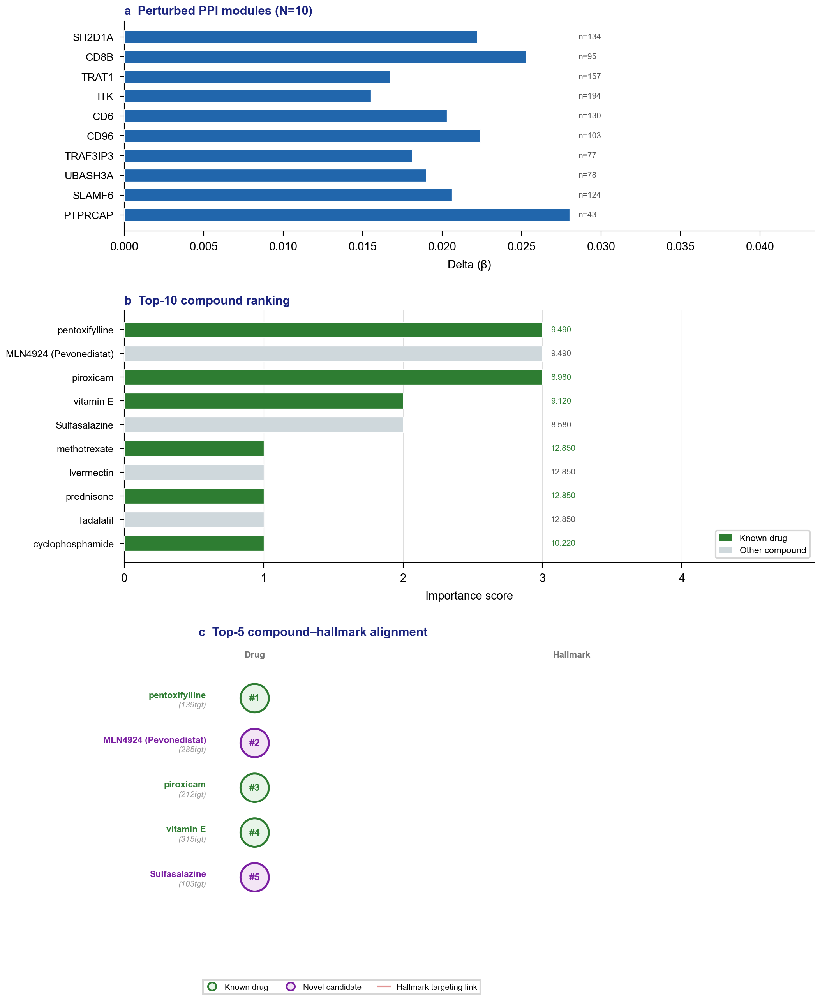
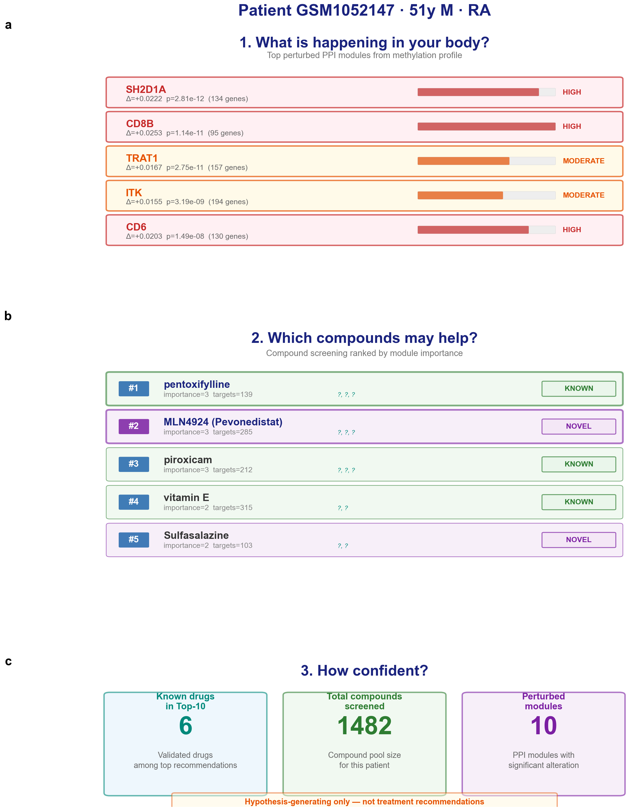
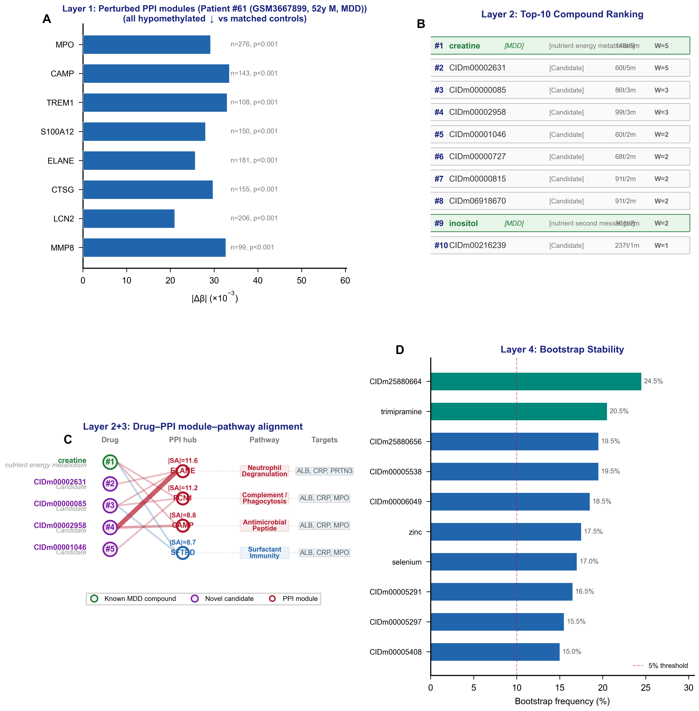
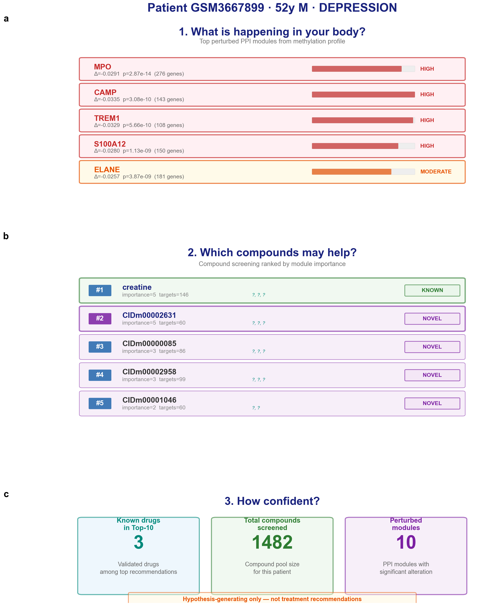

<div align="center">

**[English](README.md) | [中文](README.zh-CN.md)**

# 🧬 SteeraMed Core

**面向 N-of-1 干预推理的可驭生物医学世界模型**

[](https://www.python.org/)
[](LICENSE)
[](https://doi.org/10.20944/preprints202605.1578.v1)
[](https://agent.steerable.world)

</div>

---

**一条命令 → 复现论文全部图表。零配置。**

```bash
pip install steeramed-core && python -m steeramed_core reproduce --fig all
```

---

## 🖼️ 输出展示

### 衰老患者视图 — 个体化 Hallmark 报告

<table><tr>
<td width="50%"></td>
<td width="50%"></td>
</tr></table>

*左：基于 Hallmark 的生物学年龄评估与化合物推荐。右：四层证据链 — PPI 扰动模块、化合物排名、机制网络、Bootstrap 置信度。*

### 类风湿关节炎 — N=1 证据链

<table><tr>
<td width="50%"></td>
<td width="50%"></td>
</tr></table>

*患者 GSM1052147（男，51岁）。检出 10 个扰动 PPI 模块。Top 化合物：己酮可可碱（SA=9.49）。*

### 抑郁症 — N=1 证据链

<table><tr>
<td width="50%"></td>
<td width="50%"></td>
</tr></table>

*患者 GSM3667899（男，52岁）。中性粒细胞脱颗粒通路主导。Top 化合物：肌酸（SA=9.58）。*

---

## ⚡ 快速开始

### 安装与复现

```bash
# 安装
pip install steeramed-core

# 复现论文全部图表（在 results/ 下生成 6 张 PNG）
python -m steeramed_core reproduce --fig all

# 或按疾病单独复现
python -m steeramed_core reproduce --fig aging
python -m steeramed_core reproduce --fig ra
python -m steeramed_core reproduce --fig dep
```

所有图表均使用**内置示例患者数据**生成 — 无需下载、无需 API Key、零配置。

### 作为库使用

```python
from steeramed_core import load_example_patient
from steeramed_core.viz.evidence_view import plot_evidence_chain
from steeramed_core.viz.patient_view import plot_patient_view

# 加载内置示例患者
patient = load_example_patient("ra_patient_303")
print(patient.summary())

# 生成出版级图表
plot_evidence_chain(patient, save="evidence.pdf")
plot_patient_view(patient, save="report.png")
```

### 核心算法：SA Score

```python
from steeramed_core.core.semo import compute_sa_score
import numpy as np

delta = np.random.randn(1000)
target_idx = [10, 20, 30, 40, 50]
non_target_idx = list(range(100, 900))

sa = compute_sa_score(delta, target_idx, non_target_idx)
print(f"Steerability Alignment score: {sa:.3f}")
```

---

## 🏗️ 工作原理

SteeraMed 推理**哪些化合物能够将个体患者的分子状态引导回健康方向**，仅需 DNA 甲基化数据与公共数据库（PPI 网络 + 化合物靶点互作）。

### 四层证据链

```
┌─────────────────────────────────────────────────────────┐
│  Layer 1: PPI 模块扰动                                   │
│  哪些蛋白质互作模块发生了失调？                              │
│  方法：对模块基因 delta 向量执行 Welch t 检验               │
├─────────────────────────────────────────────────────────┤
│  Layer 2: 化合物可驭性对齐（SA）                           │
│  哪些化合物靶向了这些扰动模块？                              │
│  方法：重要性加权 SA Score 排名                             │
├─────────────────────────────────────────────────────────┤
│  Layer 3: 机制注释                                        │
│  化合物靶点如何映射到 PPI 模块枢纽？                        │
│  方法：靶点 → PPI 邻居 → 枢纽基因追踪                      │
├─────────────────────────────────────────────────────────┤
│  Layer 4: Bootstrap 置信度                                │
│  重采样下排名是否稳定？                                     │
│  方法：1000 次 Bootstrap 迭代 + top-k 稳定性检验            │
└─────────────────────────────────────────────────────────┘
```

### N=1 Delta 向量

对每位患者，SteeraMed 计算个体化 delta 向量：

$$\Delta_i = x_i - \bar{x}_{matched}$$

其中匹配对照按年龄（±5 岁）和性别选取。该 delta 向量随后用于识别扰动 PPI 模块并排序候选化合物。

---

## 📁 项目结构

```
steeramed_core/
├── core/
│   ├── config.py            # 疾病预设（RA、抑郁症、衰老、乳腺癌）
│   ├── semo.py              # SA Score + Welch t 检验 + 重要性投票
│   ├── delta.py             # N=1 delta 向量 + 年龄/性别匹配
│   └── evidence_chain.py    # 四层证据链 dataclass
├── viz/
│   ├── theme.py             # 统一视觉主题（Nature 级配色）
│   ├── patient_view.py      # 患者友好三面板卡片视图
│   └── evidence_view.py     # 科学家四面板证据链
├── presets/
│   ├── datasets.json        # 数据集元信息（GSE ID、样本量）
│   ├── positive_controls.json
│   └── example_patients/    # 内置患者数据（3 个示例）
│       ├── aging_patient_rep.json
│       ├── ra_patient_303.json
│       └── dep_patient_61.json
└── examples/
    ├── reproduce_aging_patient_view.py   # Fig 4 + Fig S1
    ├── reproduce_ra_evidence_chain.py    # Fig 6 + Fig 7
    └── reproduce_dep_evidence_chain.py   # Fig 8 + Fig S2
```

---

## 📊 支持的疾病

| 疾病 | GEO 数据集 | 组织 | 病例数 | 对照数 |
|------|-----------|------|--------|--------|
| 衰老 | GSE40279 | 全血 | 473（老年） | 109（青年） |
| 类风湿关节炎 | GSE42861 | 全血 | 354 | 335 |
| 抑郁症 | GSE128235 | 全血 | 324 | 209 |
| 乳腺癌 | GSE51032 | — | 235 | 424 |

---

## 🌐 在线演示

访问 **[agent.steerable.world](https://agent.steerable.world)** 体验交互版本 — 相同的 SteeraMed 算法，配备动画可视化、演示案例和 CSV 上传支持。

---

## 📝 技术报告

> Xiong J. *SteeraMed: A Biomedical World Model for N-of-1 Intervention Reasoning across Chronic Diseases and Aging.* Preprints.org, 2026. DOI: [10.20944/preprints202605.1578.v1](https://doi.org/10.20944/preprints202605.1578.v1)

```bibtex
@article{xiong2026steeramed,
  title={SteeraMed: A Biomedical World Model for N-of-1 Intervention Reasoning across Chronic Diseases and Aging},
  author={Xiong, Jianghui},
  journal={Preprints.org},
  year={2026},
  doi={10.20944/preprints202605.1578.v1}
}
```

---

## ⚠️ 免责声明

本软件仅生成**假设生成性洞见**，不是医疗器械，不提供治疗建议。医疗决策请务必咨询合格的专业医护人员。

---

## 许可证

MIT 许可证。仅适用于本仓库的**代码**。

`steeramed_core/presets/` 中的**预计算数据文件**包含 STITCH (CC BY-NC) 的衍生结果，仅供**学术研究和教育用途**。商业用途需获得 [EMBL 授权](mailto:stitch@embl.de)。

### 数据来源与致谢

- **PPI 网络**: STRING v12.5 — CC BY 4.0
- **化合物-靶点互作**: STITCH — CC BY-NC（仅学术用途）
- **甲基化数据**: GEO (NCBI) — 公共领域
- **Hallmark 基因集**: MSigDB — CC BY 4.0

> 本仓库分发的是**预计算分析结果**（排名化合物列表、PPI 模块摘要），而非原始 STRING 或 STITCH 数据库。
